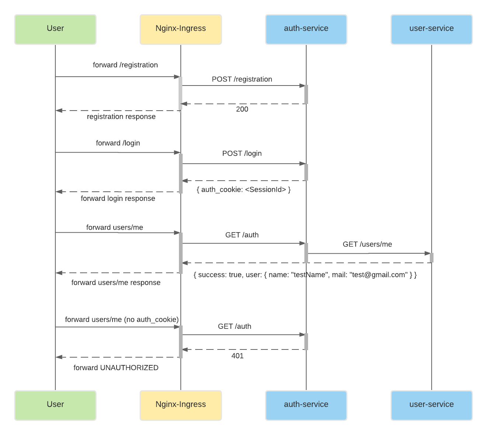
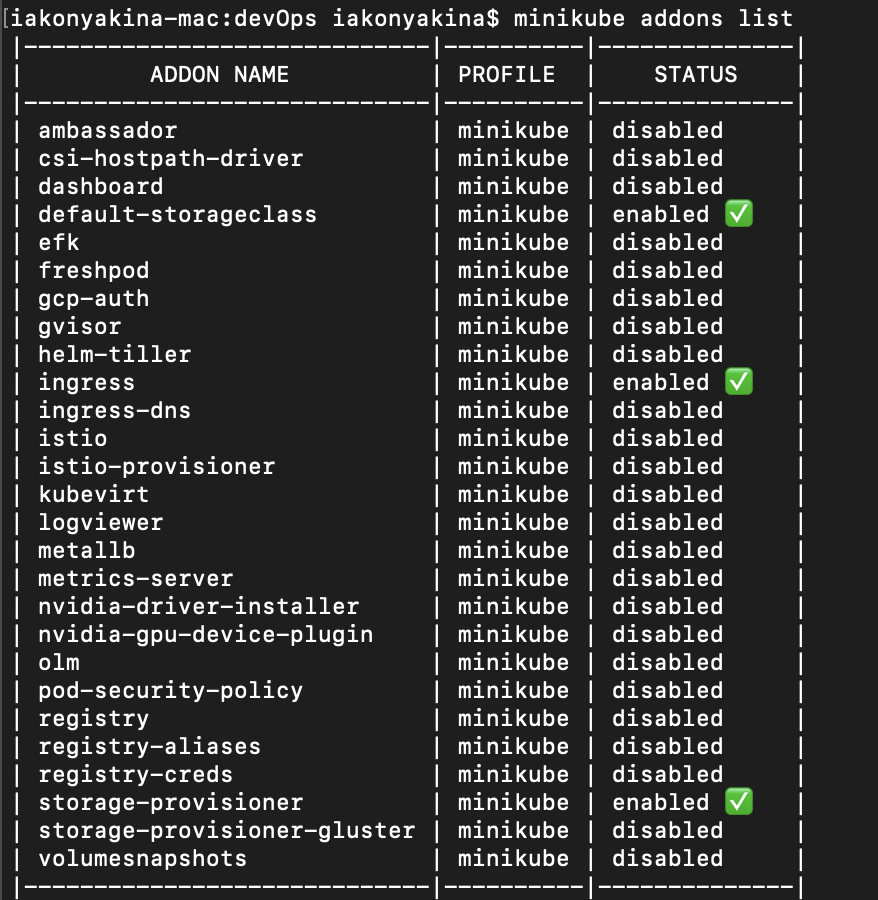
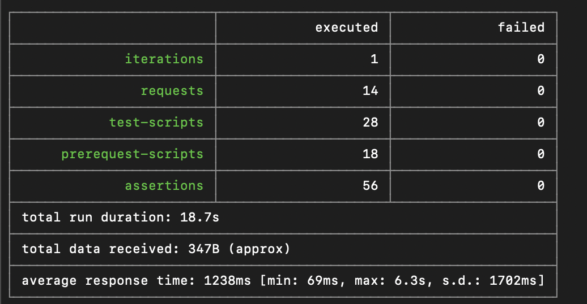

## Microservice Architecture
### Тема: API Gateway и Backends For Frontends
#### Задание №5:

Добавить в приложение аутентификацию и регистрацию пользователей.

Реализовать сценарий "Изменение и просмотр данных в профиле клиента": 
- Пользователь регистрируется. 
- Заходит под собой и по определенному урлу получает данные о своем профиле. 
- Может поменять данные в профиле. 
- Данные профиля для чтения и редактирования не должны быть доступны другим клиентам (аутентифицированным или нет). 

На выходе должны быть
1) описание архитектурного решения и схема взаимодействия сервисов (в виде картинки)
2) команда установки приложения (из helm-а или из манифестов). Обязательно указать в каком namespace нужно устанавливать. 
2*) команда установки api-gateway, если он отличен от nginx-ingress.
3) тесты постмана, которые прогоняют сценарий: 
- регистрация пользователя 1
- проверка, что изменение и получение профиля пользователя недоступно без логина
- вход пользователя 1
- изменение профиля пользователя 1
- проверка, что профиль поменялся
- выход* (если есть)
- регистрация пользователя 2
- вход пользователя 2
- проверка, что пользователь2 не имеет доступа на чтение и редактирование профиля пользователя1. 

В тестах обязательно 
- наличие {{baseUrl}} для урла
- использование домена arch.homework в качестве initial значения {{baseUrl}}
- использование сгенерированных случайно данных в сценарии
- отображение данных запроса и данных ответа при запуске из командной строки с помощью newman.

------------------------------------------------------------------

#### Схема взаимодействия сервисов


docker images:
- neversleeps/otus-arch-homework-05-auth
- neversleeps/otus-arch-homework-05-users

#### Запуск и проверка работоспособности:

В начале убедиться, что nginx ingress запущен
```shell script
minikube addons list
minikube addons enable ingress
minikube addons list
```


Устанавливаем зависимости, релиз и чарт приложений для аутентификации и для данных пользователей:
```shell script
helm dependency update ./auth
helm install auth ./auth
helm dependency update ./app
helm install app ./app
```

Запускаем тесты с помощью newman и проверяем, что все корректно запустилось:
```shell script
newman run architecture_task_5.postman_collection.json
```
```
iakonyakina-mac:devOps iakonyakina$ newman run architecture_task_5.postman_collection.json
newman

architecture_task_5

→ get unathorised user profile
  GET http://arch.homework/users/me [401 Unauthorized, 202B, 2.2s]
  ✓  [INFO] Request headers: [{"key":"User-Agent","value":"PostmanRuntime/7.26.10","system":true},{"key":"Accept","value":"*/*","system":true},{"key":"Cache-Control","value":"no-cache","system":true},{"key":"Postman-Token","value":"cef7f9a3-4b43-4e30-94f5-bec3cfba4708","system":true},{"key":"Host","value":"arch.homework","system":true},{"key":"Accept-Encoding","value":"gzip, deflate, br","system":true},{"key":"Connection","value":"keep-alive","system":true},{"key":"Referer","value":"http://arch.homework/users/me","system":true}]
  ✓  [INFO] Request body: undefined
  ✓  [INFO] Response headers: [{"key":"Date","value":"Fri, 19 Mar 2021 22:07:56 GMT"},{"key":"Content-Type","value":"application/json"},{"key":"Content-Length","value":"60"},{"key":"Connection","value":"keep-alive"}]
  ✓  [INFO] Response body: undefined

→ registration user 1
  POST http://arch.homework/register [200 OK, 99B, 6.3s]
  ✓  [INFO] Request headers: [{"key":"Content-Type","value":"application/json","system":true},{"key":"User-Agent","value":"PostmanRuntime/7.26.10","system":true},{"key":"Accept","value":"*/*","system":true},{"key":"Cache-Control","value":"no-cache","system":true},{"key":"Postman-Token","value":"08760aa8-2b7a-4f08-b90d-5c6f59f2240e","system":true},{"key":"Host","value":"arch.homework","system":true},{"key":"Accept-Encoding","value":"gzip, deflate, br","system":true},{"key":"Connection","value":"keep-alive","system":true},{"key":"Content-Length","value":80,"system":true}]
  ✓  [INFO] Request body: {  
    "login": "Rhett_Powlowski",  
    "password": "kPCTTHQtdQnn8UH"    
}
  ✓  [INFO] Response headers: [{"key":"Date","value":"Fri, 19 Mar 2021 22:08:03 GMT"},{"key":"Content-Length","value":"0"},{"key":"Connection","value":"keep-alive"}]
  ✓  [INFO] Response body: undefined

→ login user 1
  POST http://arch.homework/login [200 OK, 158B, 2s]
  ✓  [INFO] Request headers: [{"key":"Content-Type","value":"application/json","system":true},{"key":"User-Agent","value":"PostmanRuntime/7.26.10","system":true},{"key":"Accept","value":"*/*","system":true},{"key":"Cache-Control","value":"no-cache","system":true},{"key":"Postman-Token","value":"7834aa98-cc27-49f0-9063-11e042aa2acd","system":true},{"key":"Host","value":"arch.homework","system":true},{"key":"Accept-Encoding","value":"gzip, deflate, br","system":true},{"key":"Connection","value":"keep-alive","system":true},{"key":"Content-Length","value":80,"system":true}]
  ✓  [INFO] Request body: {  
    "login": "Rhett_Powlowski",  
    "password": "kPCTTHQtdQnn8UH"    
}
  ✓  [INFO] Response headers: [{"key":"Date","value":"Fri, 19 Mar 2021 22:08:05 GMT"},{"key":"Content-Length","value":"0"},{"key":"Connection","value":"keep-alive"},{"key":"Set-Cookie","value":"arch_homework_auth_cookie=1; Path=/; HttpOnly"}]
  ✓  [INFO] Response body: undefined

→ get user profile 1 (not found)
  GET http://arch.homework/users/me [200 OK, 169B, 3s]
  ✓  [INFO] Request headers: [{"key":"User-Agent","value":"PostmanRuntime/7.26.10","system":true},{"key":"Accept","value":"*/*","system":true},{"key":"Cache-Control","value":"no-cache","system":true},{"key":"Postman-Token","value":"44bed81e-fce5-4e3d-845c-3e3d6597d61d","system":true},{"key":"Host","value":"arch.homework","system":true},{"key":"Accept-Encoding","value":"gzip, deflate, br","system":true},{"key":"Connection","value":"keep-alive","system":true},{"key":"Cookie","value":"arch_homework_auth_cookie=1","system":true}]
  ✓  [INFO] Request body: undefined
  ✓  [INFO] Response headers: [{"key":"Date","value":"Fri, 19 Mar 2021 22:08:08 GMT"},{"key":"Content-Type","value":"application/json"},{"key":"Transfer-Encoding","value":"chunked"},{"key":"Connection","value":"keep-alive"}]
  ✓  [INFO] Response body: undefined

→ update user profile 1
  POST http://arch.homework/users/me [200 OK, 99B, 536ms]
  ✓  [INFO] Request headers: [{"key":"Content-Type","value":"application/json","system":true},{"key":"User-Agent","value":"PostmanRuntime/7.26.10","system":true},{"key":"Accept","value":"*/*","system":true},{"key":"Cache-Control","value":"no-cache","system":true},{"key":"Postman-Token","value":"0ce7accd-f23c-4e2a-a549-649119d44d75","system":true},{"key":"Host","value":"arch.homework","system":true},{"key":"Accept-Encoding","value":"gzip, deflate, br","system":true},{"key":"Connection","value":"keep-alive","system":true},{"key":"Content-Length","value":87,"system":true},{"key":"Cookie","value":"arch_homework_auth_cookie=1","system":true}]
  ✓  [INFO] Request body: {  
    "name": "Sandy.Marvin",  
    "mail": "Rosario.Stoltenberg0@yahoo.com"    
}
  ✓  [INFO] Response headers: [{"key":"Date","value":"Fri, 19 Mar 2021 22:08:09 GMT"},{"key":"Content-Length","value":"0"},{"key":"Connection","value":"keep-alive"}]
  ✓  [INFO] Response body: undefined

→ get user profile 1
  GET http://arch.homework/users/me [200 OK, 227B, 106ms]
  ✓  [INFO] Request headers: [{"key":"User-Agent","value":"PostmanRuntime/7.26.10","system":true},{"key":"Accept","value":"*/*","system":true},{"key":"Cache-Control","value":"no-cache","system":true},{"key":"Postman-Token","value":"fc4a7b0b-f55e-409a-b6ae-72aa475f4a35","system":true},{"key":"Host","value":"arch.homework","system":true},{"key":"Accept-Encoding","value":"gzip, deflate, br","system":true},{"key":"Connection","value":"keep-alive","system":true},{"key":"Cookie","value":"arch_homework_auth_cookie=1","system":true}]
  ✓  [INFO] Request body: undefined
  ✓  [INFO] Response headers: [{"key":"Date","value":"Fri, 19 Mar 2021 22:08:09 GMT"},{"key":"Content-Type","value":"application/json"},{"key":"Transfer-Encoding","value":"chunked"},{"key":"Connection","value":"keep-alive"}]
  ✓  [INFO] Response body: undefined

→ logout user 1
  POST http://arch.homework/logout [200 OK, 199B, 333ms]
  ✓  [INFO] Request headers: [{"key":"User-Agent","value":"PostmanRuntime/7.26.10","system":true},{"key":"Accept","value":"*/*","system":true},{"key":"Cache-Control","value":"no-cache","system":true},{"key":"Postman-Token","value":"ad52117b-b74e-424a-9881-066bf639d838","system":true},{"key":"Host","value":"arch.homework","system":true},{"key":"Accept-Encoding","value":"gzip, deflate, br","system":true},{"key":"Connection","value":"keep-alive","system":true},{"key":"Cookie","value":"arch_homework_auth_cookie=1","system":true},{"key":"Content-Length","value":0,"system":true}]
  ✓  [INFO] Request body: 
  ✓  [INFO] Response headers: [{"key":"Date","value":"Fri, 19 Mar 2021 22:08:09 GMT"},{"key":"Content-Length","value":"0"},{"key":"Connection","value":"keep-alive"},{"key":"Set-Cookie","value":"arch_homework_auth_cookie=; Max-Age=0; Expires=Thu, 01-Jan-1970 00:00:10 GMT; HttpOnly"}]
  ✓  [INFO] Response body: undefined

→ get user profile 1 (unathorised)
  GET http://arch.homework/users/me [401 Unauthorized, 202B, 150ms]
  ✓  [INFO] Request headers: [{"key":"User-Agent","value":"PostmanRuntime/7.26.10","system":true},{"key":"Accept","value":"*/*","system":true},{"key":"Cache-Control","value":"no-cache","system":true},{"key":"Postman-Token","value":"2bfcd921-b866-4bca-8b27-17ecd6eddb2d","system":true},{"key":"Host","value":"arch.homework","system":true},{"key":"Accept-Encoding","value":"gzip, deflate, br","system":true},{"key":"Connection","value":"keep-alive","system":true},{"key":"Referer","value":"http://arch.homework/users/me","system":true}]
  ✓  [INFO] Request body: undefined
  ✓  [INFO] Response headers: [{"key":"Date","value":"Fri, 19 Mar 2021 22:08:10 GMT"},{"key":"Content-Type","value":"application/json"},{"key":"Content-Length","value":"60"},{"key":"Connection","value":"keep-alive"}]
  ✓  [INFO] Response body: undefined

→ registration user 2
  POST http://arch.homework/register [200 OK, 99B, 186ms]
  ✓  [INFO] Request headers: [{"key":"Content-Type","value":"application/json","system":true},{"key":"User-Agent","value":"PostmanRuntime/7.26.10","system":true},{"key":"Accept","value":"*/*","system":true},{"key":"Cache-Control","value":"no-cache","system":true},{"key":"Postman-Token","value":"662c644b-a765-4520-8455-cd64a2d3e5dc","system":true},{"key":"Host","value":"arch.homework","system":true},{"key":"Accept-Encoding","value":"gzip, deflate, br","system":true},{"key":"Connection","value":"keep-alive","system":true},{"key":"Content-Length","value":73,"system":true}]
  ✓  [INFO] Request body: {  
    "login": "Marcel46",  
    "password": "g8qpMmutROhlfqg"    
}
  ✓  [INFO] Response headers: [{"key":"Date","value":"Fri, 19 Mar 2021 22:08:10 GMT"},{"key":"Content-Length","value":"0"},{"key":"Connection","value":"keep-alive"}]
  ✓  [INFO] Response body: undefined

→ login user 2
  POST http://arch.homework/login [200 OK, 158B, 1422ms]
  ✓  [INFO] Request headers: [{"key":"Content-Type","value":"application/json","system":true},{"key":"User-Agent","value":"PostmanRuntime/7.26.10","system":true},{"key":"Accept","value":"*/*","system":true},{"key":"Cache-Control","value":"no-cache","system":true},{"key":"Postman-Token","value":"ec75bc2b-8621-499b-aad1-5c7146d06de8","system":true},{"key":"Host","value":"arch.homework","system":true},{"key":"Accept-Encoding","value":"gzip, deflate, br","system":true},{"key":"Connection","value":"keep-alive","system":true},{"key":"Content-Length","value":73,"system":true}]
  ✓  [INFO] Request body: {  
    "login": "Marcel46",  
    "password": "g8qpMmutROhlfqg"    
}
  ✓  [INFO] Response headers: [{"key":"Date","value":"Fri, 19 Mar 2021 22:08:11 GMT"},{"key":"Content-Length","value":"0"},{"key":"Connection","value":"keep-alive"},{"key":"Set-Cookie","value":"arch_homework_auth_cookie=2; Path=/; HttpOnly"}]
  ✓  [INFO] Response body: undefined

→ get user profile 2 (not found)
  GET http://arch.homework/users/me [200 OK, 169B, 69ms]
  ✓  [INFO] Request headers: [{"key":"User-Agent","value":"PostmanRuntime/7.26.10","system":true},{"key":"Accept","value":"*/*","system":true},{"key":"Cache-Control","value":"no-cache","system":true},{"key":"Postman-Token","value":"a740cb88-ac7a-45e9-b8ec-da211b25b6c2","system":true},{"key":"Host","value":"arch.homework","system":true},{"key":"Accept-Encoding","value":"gzip, deflate, br","system":true},{"key":"Connection","value":"keep-alive","system":true},{"key":"Cookie","value":"arch_homework_auth_cookie=2","system":true}]
  ✓  [INFO] Request body: undefined
  ✓  [INFO] Response headers: [{"key":"Date","value":"Fri, 19 Mar 2021 22:08:11 GMT"},{"key":"Content-Type","value":"application/json"},{"key":"Transfer-Encoding","value":"chunked"},{"key":"Connection","value":"keep-alive"}]
  ✓  [INFO] Response body: undefined

→ update user profile 2
  POST http://arch.homework/users/me [200 OK, 99B, 236ms]
  ✓  [INFO] Request headers: [{"key":"Content-Type","value":"application/json","system":true},{"key":"User-Agent","value":"PostmanRuntime/7.26.10","system":true},{"key":"Accept","value":"*/*","system":true},{"key":"Cache-Control","value":"no-cache","system":true},{"key":"Postman-Token","value":"731f4a01-434b-4ddb-8dbe-e64b41349350","system":true},{"key":"Host","value":"arch.homework","system":true},{"key":"Accept-Encoding","value":"gzip, deflate, br","system":true},{"key":"Connection","value":"keep-alive","system":true},{"key":"Content-Length","value":82,"system":true},{"key":"Cookie","value":"arch_homework_auth_cookie=2","system":true}]
  ✓  [INFO] Request body: {  
    "name": "Hobart_Batz26",  
    "mail": "Aurore_Gerlach@gmail.com"    
}
  ✓  [INFO] Response headers: [{"key":"Date","value":"Fri, 19 Mar 2021 22:08:12 GMT"},{"key":"Content-Length","value":"0"},{"key":"Connection","value":"keep-alive"}]
  ✓  [INFO] Response body: undefined

→ get user profile 2
  GET http://arch.homework/users/me [200 OK, 222B, 180ms]
  ✓  [INFO] Request headers: [{"key":"User-Agent","value":"PostmanRuntime/7.26.10","system":true},{"key":"Accept","value":"*/*","system":true},{"key":"Cache-Control","value":"no-cache","system":true},{"key":"Postman-Token","value":"e2d75d5f-ec08-4d1f-b0e6-46b242fd7a3a","system":true},{"key":"Host","value":"arch.homework","system":true},{"key":"Accept-Encoding","value":"gzip, deflate, br","system":true},{"key":"Connection","value":"keep-alive","system":true},{"key":"Cookie","value":"arch_homework_auth_cookie=2","system":true}]
  ✓  [INFO] Request body: undefined
  ✓  [INFO] Response headers: [{"key":"Date","value":"Fri, 19 Mar 2021 22:08:12 GMT"},{"key":"Content-Type","value":"application/json"},{"key":"Transfer-Encoding","value":"chunked"},{"key":"Connection","value":"keep-alive"}]
  ✓  [INFO] Response body: undefined

→ logout user 2
  POST http://arch.homework/logout [200 OK, 199B, 351ms]
  ✓  [INFO] Request headers: [{"key":"User-Agent","value":"PostmanRuntime/7.26.10","system":true},{"key":"Accept","value":"*/*","system":true},{"key":"Cache-Control","value":"no-cache","system":true},{"key":"Postman-Token","value":"2c1a658e-5f70-4bdf-b8f2-74ac23059f63","system":true},{"key":"Host","value":"arch.homework","system":true},{"key":"Accept-Encoding","value":"gzip, deflate, br","system":true},{"key":"Connection","value":"keep-alive","system":true},{"key":"Cookie","value":"arch_homework_auth_cookie=2","system":true},{"key":"Content-Length","value":0,"system":true}]
  ✓  [INFO] Request body: 
  ✓  [INFO] Response headers: [{"key":"Date","value":"Fri, 19 Mar 2021 22:08:12 GMT"},{"key":"Content-Length","value":"0"},{"key":"Connection","value":"keep-alive"},{"key":"Set-Cookie","value":"arch_homework_auth_cookie=; Max-Age=0; Expires=Thu, 01-Jan-1970 00:00:10 GMT; HttpOnly"}]
  ✓  [INFO] Response body: undefined
```
