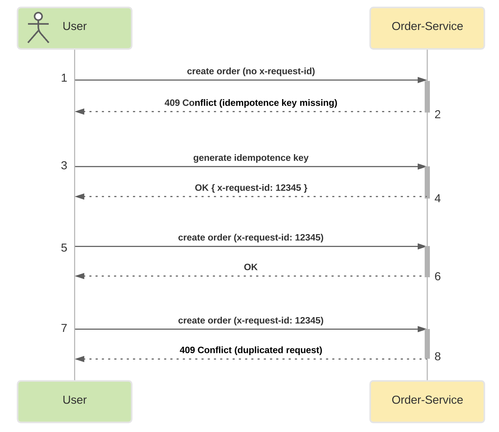
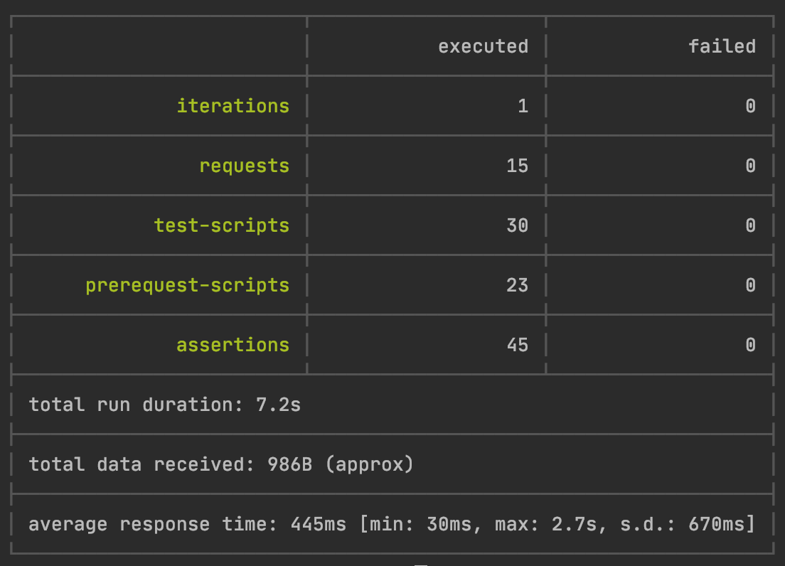

## Microservice Architecture
### Тема: Идемпотентность и коммутативность API в HTTP и очередях
#### Задание №7:

Создайте сервис "Заказ" (или используйте сервис из прошлого занятия) и для одного из его методов, например, "создание заказа" сделать идемпотетным.

На выходе должно быть: 
- описание того, какой паттерн для реализации идемпотентности использовался
- команда установки приложения (из helm-а или из манифестов). 
- тесты в postman. В тестах обязательно использование домена arch.homework в качестве initial значения {{baseUrl}}


Обязательно указать в каком namespace нужно устанавливать и команду создания namespace, если это важно для сервиса.

------------------------------------------------------------------
### Реализация

Идемпотентность реализована с помощью ключа идемпотентности x-request-id в рамках сервиса order-service.
Генерация ключа происходит в order-service, поскольку проект учебный и в качестве клиента для демонстрации предполагается использование Postman'а.
Сервисы billing-service, notification-service, user-service взяты с предыдущего занятия, изменения в них не вносились.




#### docker images:
- ```neversleeps/user-service-07-2```
- ```neversleeps/billing-service-07-2```
- ```neversleeps/order-service-07-2```
- ```neversleeps/notification-service-07-2```

### Запуск
выполняется внутри папки devOps
```shell script
minikube start --cpus=6 --memory=6g --vm-driver=hyperkit
eval $(minikube docker-env)
docker ps
```

```shell script
kubectl create namespace messaging
kubectl config set-context --current --namespace=messaging

helm repo add bitnami https://charts.bitnami.com/bitnami
helm install zookeeper bitnami/zookeeper --set replicaCount=1 --set auth.enabled=false --set allowAnonymousLogin=true --atomic
helm install kafka bitnami/kafka --set zookeeper.enabled=false --set replicaCount=1 --set externalZookeeper.servers=zookeeper.messaging.svc.cluster.local --atomic

kubectl create namespace dev
kubectl config set-context --current --namespace=dev

helm install user-service charts/user-service --atomic
helm install billing-service charts/billing-service --atomic
helm install order-service charts/order-service --atomic
helm install notification-service charts/notification-service --atomic

kubectl create namespace monitoring
helm repo add ingress-nginx https://kubernetes.github.io/ingress-nginx/
helm install nginx stable/nginx-ingress --namespace monitoring -f nginx-ingress.yaml
```

Получаем адрес сервиса, чтобы прописать его в /etc/hosts: 
```shell script
minikube service user-service  --url -n dev
```

### Запуск тестов
```shell script
newman run postman/User-Billing-Order-Notification-SERVICES-API.postman_collection.json
```
```
User-Billing-Order-Notification-SERVICES-API

→ Create user
  POST arch.homework/users [201 Created, 308B, 2.7s]
  ✓  app should create user and receive 201
  ✓  [INFO] Request: {
    "username": "Delphia_Sauer",
    "email": "Neha_Larkin55@yahoo.com",
    "phone": "+45296008972032",
    "firstName": "Bradford",
    "lastName": "Bergstrom"
}
  ✓  [INFO] Response: {"id":1,"username":"Delphia_Sauer","firstName":"Bradford","lastName":"Bergstrom","email":"Neha_Larkin55@yahoo.com","phone":"+45296008972032"}

→ Get user by userId
  GET arch.homework/users/1 [200 OK, 350B, 109ms]
  ✓  app should find user by id
  ✓  [INFO] Request: [object Object]
  ✓  [INFO] Response: {"id":1,"username":"Delphia_Sauer","firstName":"Bradford","lastName":"Bergstrom","email":"Neha_Larkin55@yahoo.com","phone":"+45296008972032"}

→ Get billing account by userId
  GET arch.homework/billing/accounts/1 [200 OK, 274B, 644ms]
  ✓  app should find account by user id
  ✓  [INFO] Request: [object Object]
  ✓  [INFO] Response: {"id":1,"userId":1,"email":"Neha_Larkin55@yahoo.com","balance":0}

→ Send deposit for account by userId
  POST arch.homework/billing/accounts/1/deposit [200 OK, 121B, 203ms]
  ✓  app should send deposit money for account by user id
  ✓  [INFO] Request: {
    "amount": 100
}
  ✓  [INFO] Response: 

→ Get billing account by userId after deposit
  GET arch.homework/billing/accounts/1 [200 OK, 276B, 61ms]
  ✓  app should find account by user id after deposit
  ✓  [INFO] Request: [object Object]
  ✓  [INFO] Response: {"id":1,"userId":1,"email":"Neha_Larkin55@yahoo.com","balance":100}

→ Create order for userId without x-request-id
  POST arch.homework/orders [409 Conflict, 216B, 612ms]
  ✓  app should return 'idempotence key missing' error for non-idempotent order
  ✓  [INFO] Request: {
    "userId": 1,
    "price": 50
}
  ✓  [INFO] Response: {"code":409,"message":"idempotence key missing"}

→ Create idempotency key
  POST arch.homework/idempotence-key/generate [200 OK, 173B, 177ms]
  ✓  app should return generated idempotence key
  ✓  [INFO] Request: [object Object]
  ✓  [INFO] Response: 

→ Create order for userId
  POST arch.homework/orders [200 OK, 239B, 921ms]
  ✓  app should create order
  ✓  [INFO] Request: {
    "userId": 1,
    "price": 50
}
  ✓  [INFO] Response: {"id":1,"price":50,"userId":1}

→ Create order for userId with duplicate key
  POST arch.homework/orders [409 Conflict, 216B, 145ms]
  ✓  app should return 'duplicated request' error for creating order with duplicate key
  ✓  [INFO] Request: {
    "userId": 1,
    "price": 50
}
  ✓  [INFO] Response: {"code":409,"message":"idempotence key missing"}

→ Get billing after order success
  GET arch.homework/billing/accounts/1 [200 OK, 275B, 31ms]
  ✓  tapp should find account by user id after creating order
  ✓  [INFO] Request: [object Object]
  ✓  [INFO] Response: {"id":1,"userId":1,"email":"Neha_Larkin55@yahoo.com","balance":50}

→ Get notifications
  GET arch.homework/notifications [200 OK, 287B, 617ms]
  ✓  app should find notification with state success
  ✓  [INFO] Request: {
    "username": "john.doe",
    "email": "test@mail.com",
    "phone": "123",
    "firstName": "John",
    "lastName": "Doe"
}
  ✓  [INFO] Response: [{"state":"SUCCESS","orderId":1,"userId":1,"email":"Neha_Larkin55@yahoo.com"}]

→ Create idempotency key
  POST arch.homework/idempotence-key/generate [200 OK, 173B, 108ms]
  ✓  app should return generated idempotence key
  ✓  [INFO] Request: [object Object]
  ✓  [INFO] Response: 

→ Create order with account balance exception
  POST arch.homework/orders [400 Bad Request, 249B, 163ms]
  ✓  app should return acount alance error for creating order
  ✓  [INFO] Request: {
    "userId": 1,
    "price": 1000
}
  ✓  [INFO] Response: {"code":400,"message":"Ошибка оплаты для userId=1, price=1000"}

→ Get billing after order failure
  GET arch.homework/billing/accounts/1 [200 OK, 275B, 30ms]
  ✓  app should find account by id after successful creating order
  ✓  [INFO] Request: [object Object]
  ✓  [INFO] Response: {"id":1,"userId":1,"email":"Neha_Larkin55@yahoo.com","balance":50}

→ Get notifications
  GET arch.homework/notifications [200 OK, 367B, 115ms]
  ✓  app should find notification with state FAILURE
  ✓  [INFO] Request: {
    "username": "john.doe",
    "email": "test@mail.com",
    "phone": "123",
    "firstName": "John",
    "lastName": "Doe"
}
  ✓  [INFO] Response: [{"state":"SUCCESS","orderId":1,"userId":1,"email":"Neha_Larkin55@yahoo.com"},{"state":"FAILURE","orderId":null,"userId":1,"email":"Neha_Larkin55@yahoo.com"}]
```

