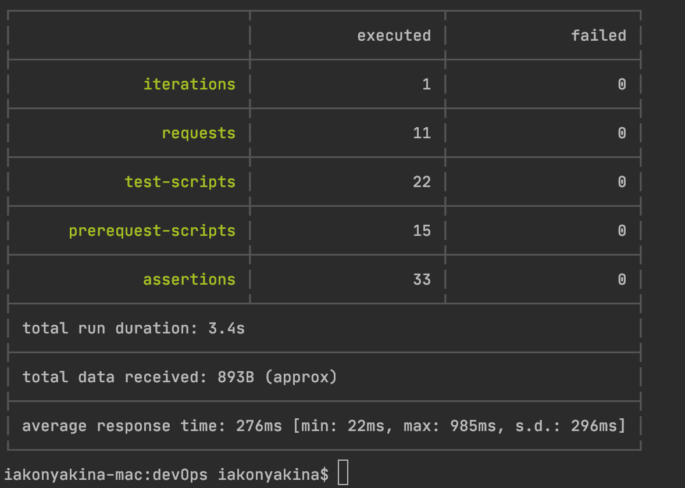

## Microservice Architecture
### Тема: Stream processing
#### Задание №7:

Реализовать сервис заказа. Сервис биллинга. Сервис нотификаций.

При создании пользователя, необходимо создавать аккаунт в сервисе биллинга.
В сервисе биллинга должна быть возможность положить деньги на аккаунт и снять деньги.
Сервис нотификаций позволяет отправить сообщение на email. И позволяет получить список сообщений по методу API.

Пользователь может создать заказ. У заказа есть параметр - цена заказа. Заказ происходит в 2 этапа:
- сначала снимаем деньги с пользователя с помощью сервиса биллинга
- отсылаем пользователю сообщение на почту с результатами оформления заказа. Если биллинг подтвердил платеж, должно отослаться письмо счастья. Если нет, то письмо горя.

Упрощаем и считаем, что ничего плохого с сервисами происходить не может (они не могут падать и т.д.). Сервис нотификаций на самом деле не отправляет, а просто сохраняет в БД.

ТЕОРЕТИЧЕСКАЯ ЧАСТЬ:

Спроектировать взаимодействие сервисов при создании заказов. Предоставить варианты взаимодействий в следующих стилях в виде sequence диаграммы с описанием API на IDL:
- только HTTP взаимодействие
- событийное взаимодействие с использование брокера сообщений для нотификаций (уведомлений)
- Event Collaboration cтиль взаимодействия с использованием брокера сообщений
- вариант, который вам кажется наиболее адекватным для решения данной задачи. Если он совпадает одним из вариантов выше - просто отметить это.

ПРАКТИЧЕСКАЯ ЧАСТЬ: 

Выбрать один из вариантов и реализовать его. На выходе должны быть:
- описание архитектурного решения и схема взаимодействия сервисов (в виде картинки)
- команда установки приложения (из helm-а или из манифестов). Обязательно указать в каком namespace нужно устанавливать.
- тесты постмана, которые прогоняют сценарий:
    - Создать пользователя. Должен создаться аккаунт в биллинге.
    - Положить деньги на счет пользователя через сервис биллинга.
    - Сделать заказ, на который хватает денег.
    - Посмотреть деньги на счету пользователя и убедиться, что их сняли.
    - Посмотреть в сервисе нотификаций отправленные сообщения и убедиться, что сообщение отправилось
    - Сделать заказ, на который не хватает денег.
    - Посмотреть деньги на счету пользователя и убедиться, что их количество не поменялось.
    - Посмотреть в сервисе нотификаций отправленные сообщения и убедиться, что сообщение отправилось.

В тестах обязательно:
- наличие {{baseUrl}} для урла
- использование домена arch.homework в качестве initial значения {{baseUrl}}
- отображение данных запроса и данных ответа при запуске из командной строки с помощью newman.

------------------------------------------------------------------
### Реализация

docker images:
- ```neversleeps/user-service-07```
- ```neversleeps/billing-service-07```
- ```neversleeps/order-service-07```
- ```neversleeps/notification-service-07```

### Запуск
```shell script
minikube start --cpus=6 --memory=6g --vm-driver=hyperkit
eval $(minikube docker-env)
docker ps

kubectl create namespace messaging
kubectl config set-context --current --namespace=messaging

helm repo add bitnami https://charts.bitnami.com/bitnami
helm install zookeeper bitnami/zookeeper --set replicaCount=1 --set auth.enabled=false --set allowAnonymousLogin=true --atomic
helm install kafka bitnami/kafka --set zookeeper.enabled=false --set replicaCount=1 --set externalZookeeper.servers=zookeeper.messaging.svc.cluster.local --atomic

kubectl create namespace dev
kubectl config set-context --current --namespace=dev

helm install user-service charts/user-service --atomic
helm install billing-service charts/billing-service --atomic
helm install order-service charts/order-service --atomic
helm install notification-service charts/notification-service --atomic

kubectl create namespace monitoring
helm repo add ingress-nginx https://kubernetes.github.io/ingress-nginx/
helm install nginx stable/nginx-ingress --namespace monitoring -f nginx-ingress.yaml
```

Получаем адрес сервиса, чтобы прописать его в /etc/hosts: 
```shell script
minikube service user-service  --url -n dev
```

### Запуск тестов
```shell script
newman run postman/User-Billing-Order-Notification-SERVICES-API.postman_collection.json
```
```
User Billing Order Notification SERVICES API

→ Create user
  POST arch.homework/users [201 Created, 306B, 985ms]
  ✓  app should create user and receive 201
  ✓  [INFO] Request: {
    "username": "Gilda.Hermann52",
    "email": "Wyman_Kshlerin@gmail.com",
    "phone": "+73893145065988",
    "firstName": "Arlie",
    "lastName": "Pacocha"
}
  ✓  [INFO] Response: {"id":1,"username":"Gilda.Hermann52","firstName":"Arlie","lastName":"Pacocha","email":"Wyman_Kshlerin@gmail.com","phone":"+73893145065988"}

→ Get user by userId
  GET arch.homework/users/1 [200 OK, 348B, 99ms]
  ✓  app should find user by id
  ✓  [INFO] Request: [object Object]
  ✓  [INFO] Response: {"id":1,"username":"Gilda.Hermann52","firstName":"Arlie","lastName":"Pacocha","email":"Wyman_Kshlerin@gmail.com","phone":"+73893145065988"}

→ Get billing account by userId
  GET arch.homework/billing/accounts/1 [200 OK, 275B, 293ms]
  ✓  app should find account by user id
  ✓  [INFO] Request: [object Object]
  ✓  [INFO] Response: {"id":1,"userId":1,"email":"Wyman_Kshlerin@gmail.com","balance":0}

→ Send deposit for account by userId
  POST arch.homework/billing/accounts/1/deposit [200 OK, 121B, 121ms]
  ✓  app should send deposit money for account by user id
  ✓  [INFO] Request: {
    "amount": 100
}
  ✓  [INFO] Response: 

→ Get billing account by userId after deposit
  GET arch.homework/billing/accounts/1 [200 OK, 277B, 43ms]
  ✓  app should find account by user id after deposit
  ✓  [INFO] Request: [object Object]
  ✓  [INFO] Response: {"id":1,"userId":1,"email":"Wyman_Kshlerin@gmail.com","balance":100}

→ Create order for userId
  POST arch.homework/orders [200 OK, 239B, 660ms]
  ✓  app should create order
  ✓  [INFO] Request: {
    "userId": 1,
    "price": 50
}
  ✓  [INFO] Response: {"id":1,"price":50,"userId":1}

→ Get billing after order success
  GET arch.homework/billing/accounts/1 [200 OK, 276B, 22ms]
  ✓  tapp should find account by user id after creating order
  ✓  [INFO] Request: [object Object]
  ✓  [INFO] Response: {"id":1,"userId":1,"email":"Wyman_Kshlerin@gmail.com","balance":50}

→ Get notifications
  GET arch.homework/notifications [200 OK, 288B, 493ms]
  ✓  app should find notification with state success
  ✓  [INFO] Request: {
    "username": "john.doe",
    "email": "test@mail.com",
    "phone": "123",
    "firstName": "John",
    "lastName": "Doe"
}
  ✓  [INFO] Response: [{"state":"SUCCESS","orderId":1,"userId":1,"email":"Wyman_Kshlerin@gmail.com"}]

→ Create order with account balance exception
  POST arch.homework/orders [400 Bad Request, 249B, 184ms]
  ✓  app should create order
  ✓  [INFO] Request: {
    "userId": 1,
    "price": 1000
}
  ✓  [INFO] Response: {"code":400,"message":"Ошибка оплаты для userId=1, price=1000"}

→ Get billing after order failure
  GET arch.homework/billing/accounts/1 [200 OK, 276B, 32ms]
  ✓  app should find account by id after successful creating order
  ✓  [INFO] Request: [object Object]
  ✓  [INFO] Response: {"id":1,"userId":1,"email":"Wyman_Kshlerin@gmail.com","balance":50}

→ Get notifications
  GET arch.homework/notifications [200 OK, 369B, 111ms]
  ✓  app should find notification with state FAILURE
  ✓  [INFO] Request: {
    "username": "john.doe",
    "email": "test@mail.com",
    "phone": "123",
    "firstName": "John",
    "lastName": "Doe"
}
  ✓  [INFO] Response: [{"state":"SUCCESS","orderId":1,"userId":1,"email":"Wyman_Kshlerin@gmail.com"},{"state":"FAILURE","orderId":null,"userId":1,"email":"Wyman_Kshlerin@gmail.com"}]

```
