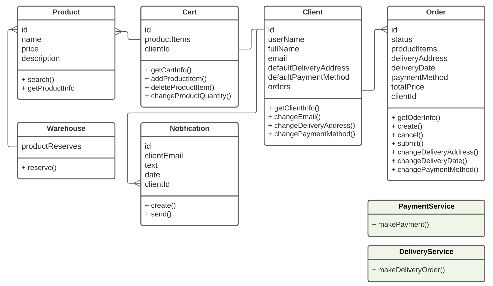
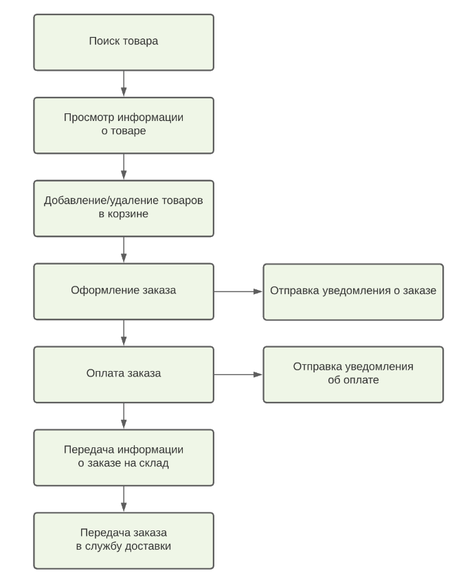
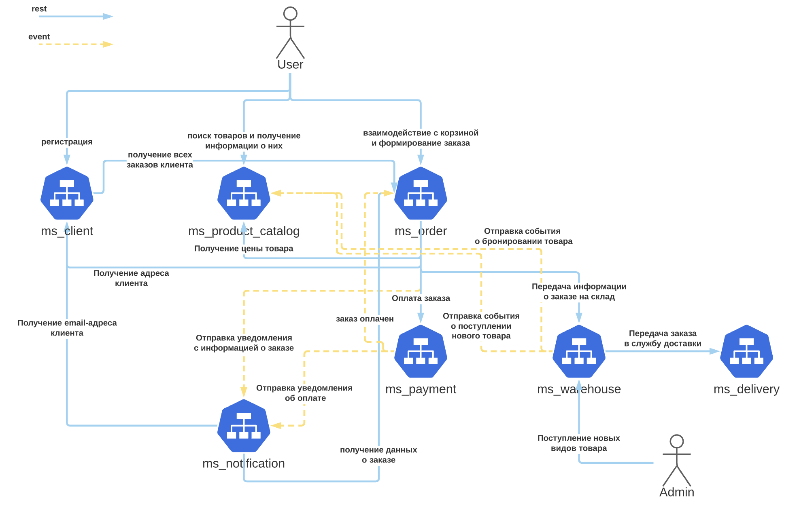

## Декомпозиция микросервисов для создания интернет-магазина

1. [Пользовательские сценарии](#Пользовательские-сценарии)
2. [Системные действия](#Системные-действия)
3. [Модель на основе ООП](#Модель-на-основе-ООП)
4. [Функциональная модель](#Функциональная-модель)
5. [Итоговая модель](#Итоговая-модель)
6. [Схема взаимодействия сервисов](#Схема-взаимодействия-сервисов)

#### Пользовательские сценарии

Есть клиент  
И есть интернет-магазин  
И клиент вводит в строке поиска "Велосипед"  
Тогда появляется список товаров, подходящих под запрос клиента

Когда клиент нажимает карточку на товар в списке результатов поиска  
Тогда клиент переходит на карточку с описанием товара

Когда клиент нажимает на кнопку "Добавить в корзину"  
Тогда товар добавляется в корзину

Когда клиент переходит в корзину  
Тогда он видит список всех добавленных им в корзину товаров

Когда клиент нажимает на кнопку "Удалить из корзины"  
Тогда товар удаляется из корзины

Когда клиент нажимает в корзине на кнопку +1 или -1 для товара  
Тогда количество единиц данного товара меняется соответственно нажатой кнопке

Когда клиент нажимает на кнопку "Оформить заказ"   
Тогда клиент переходит на страницу оформления заказа, которая предлагает заполнить адрес и дату доставки или же использовать данные по умолчанию

Когда клиент при оформлении заказа переходит к оплате  
Тогда возникает форма оплаты

Когда клиент производит оплату заказа  
Тогда появляется окно "Заказ оплачен"  
И клиенту приходит уведомление с информацией о заказе и успешной оплате  
И заказ резервируется на складе  
И создаётся заявка для службы доставки

#### Системные действия:
- клиент может искать товар, используя те или иные фильтры
- клиент может получить информацию о товаре
- клиент может положить товар в корзину
- клиент может удалить товар из корзины
- клиент может изменить количество добавленных в корзину товаров
- клиент может оформить заказ
- клиент может указать адрес, время и дату доставки
- клиент может выбрать способ оплаты
- клиент может оплатить заказ
- приложение отправляет клиенту уведомление с информацией о сделанном заказе
- приложение отправляет клиенту уведомление об успешной/неуспешной оплате
- приложение резервирует товар на складе после оформления заказа
- приложение передаёт заказ в службу доставки

#### Модель на основе ООП

Основные сущности:
- Клиент
- Товар
- Корзина
- Заказ
- Уведомление
- Склад
- Оплата
- Служба доставки

Сервисы:
- ClientService
- ProductService
- CartService
- OrderService
- NotificationService
- WarehouseService

А также:
- PaymentService
- DeliveryService

#### Функциональная модель

Сервисы:
- ProductSearchService (поиск товара и просмотр информации о нём)
- OrderService (добавление/удаление товаров в корзине и оформление заказа)
- WarehouseService (передача информации о заказе на склад) 
- NotificationService (отправка уведомлений)
- PaymentService (оплата заказа)
- DeliveryService (передача заказа в службу доставки)

#### Итоговая модель

Доработка модели:
- Поскольку работа с корзиной во многом связано с оформлением заказа, 
сервисы CartService и OrderService, получившиеся в модели на основе ООП, сильно связные.
Есть смысл объединить их в один - OrderService (он же получился и в функциональной модели).

Сервисы:
- Client
- ProductCatalog
- Order
- Payment
- Warehouse
- Delivery
- Notification

#### Схема взаимодействия сервисов

