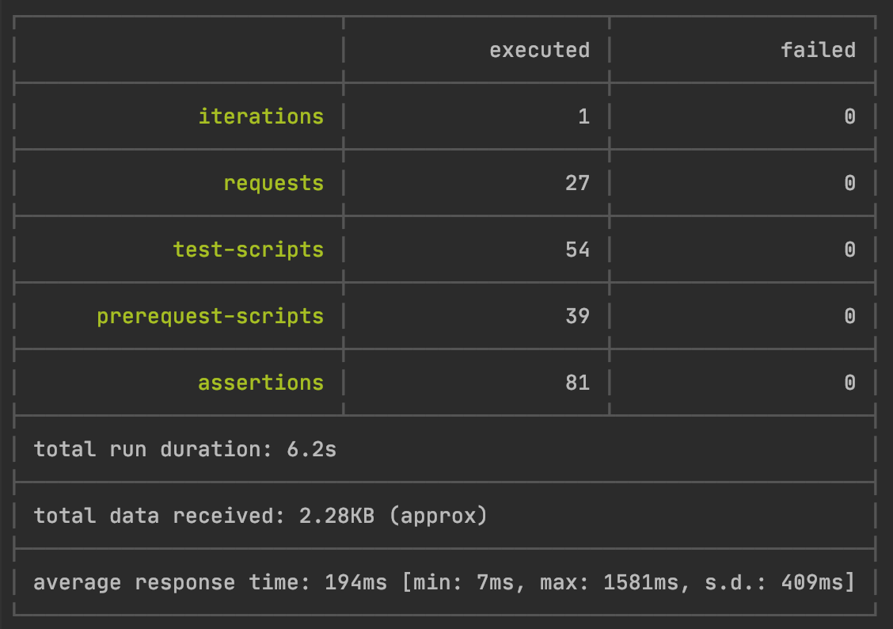

## Microservice Architecture
### Тема: Распределенные транзакции
#### Задание №9:

Реализовать распределенную транзакцию. Можно использовать приведенный ниже сценарий для интернет-магазина или придумать свой.

Дефолтный сценарий: Реализовать сервисы "Платеж", "Склад", "Доставка".
Для сервиса "Заказ", в рамках метода "создание заказа" реализовать механизм распределенной транзакции (на основе Саги или двухфазного коммита). 

Во время создания заказа необходимо:
- в сервисе "Платеж" убедиться, что платеж прошел
- в сервисе "Склад" зарезервировать конкретный товар на складе
- в сервисе "Доставка" зарезервировать курьера на конкретный слот времени.
- Если хотя бы один из пунктов не получилось сделать, необходимо откатить все остальные изменения.

На выходе должно быть: 
- описание того, какой паттерн для реализации распределенной транзакции использовался
- команда установки приложения (из helm-а или из манифестов). 
- Обязательно указать в каком namespace нужно устанавливать и команду создания namespace, если это важно для сервиса.
- тесты в postman

В тестах обязательно
использование домена arch.homework в качестве initial значения {{baseUrl}}

------------------------------------------------------------------
### Реализация


#### docker images:
- ```neversleeps/user-service-09```
- ```neversleeps/billing-service-09```
- ```neversleeps/order-service-09```
- ```neversleeps/notification-service-09```
- ```neversleeps/stock-service-09```
- ```neversleeps/delivery-service-09```

### Запуск
выполняется внутри папки devOps
```shell script
minikube start --cpus=6 --memory=6g --vm-driver=hyperkit
eval $(minikube docker-env)
docker ps

kubectl create namespace messaging
kubectl config set-context --current --namespace=messaging

helm repo add bitnami https://charts.bitnami.com/bitnami
helm install zookeeper bitnami/zookeeper --set replicaCount=1 --set auth.enabled=false --set allowAnonymousLogin=true --atomic
helm install kafka bitnami/kafka --set zookeeper.enabled=false --set replicaCount=1 --set externalZookeeper.servers=zookeeper.messaging.svc.cluster.local --atomic

kubectl create namespace dev
kubectl config set-context --current --namespace=dev

helm install user-service charts/user-service --atomic
helm install billing-service charts/billing-service --atomic
helm install order-service charts/order-service --atomic
helm install notification-service charts/notification-service --atomic
helm install stock-service charts/stock-service --atomic
helm install delivery-service charts/delivery-service --atomic

kubectl create namespace monitoring
helm repo add ingress-nginx https://kubernetes.github.io/ingress-nginx/
helm install nginx stable/nginx-ingress --namespace monitoring -f nginx-ingress.yaml
```

Получаем адрес сервиса, чтобы прописать его в /etc/hosts: 
```shell script
minikube service user-service  --url -n dev
```

### Запуск тестов
```shell script
newman run postman/User-Billing-Order-Notification-Stock-Delivery-API.postman_collection.json
```

```
newman

User-Billing-Order-Notification-Stock-Delivery-API

→ Create user
  POST arch.homework/users [201 Created, 307B, 1529ms]
  ✓  app should create user and receive 201
  ✓  [INFO] Request: {
    "username": "Yolanda_Yost",
    "email": "General_Schuppe11@hotmail.com",
    "phone": "+13649030521752",
    "firstName": "Luigi",
    "lastName": "Cremin"
}
  ✓  [INFO] Response: {"id":1,"username":"Yolanda_Yost","firstName":"Luigi","lastName":"Cremin","email":"General_Schuppe11@hotmail.com","phone":"+13649030521752"}

→ Get user by userId
  GET arch.homework/users/1 [200 OK, 349B, 78ms]
  ✓  app should find user by id
  ✓  [INFO] Request: [object Object]
  ✓  [INFO] Response: {"id":1,"username":"Yolanda_Yost","firstName":"Luigi","lastName":"Cremin","email":"General_Schuppe11@hotmail.com","phone":"+13649030521752"}

→ Get billing account by userId
  GET arch.homework/billing/accounts/1 [200 OK, 280B, 284ms]
  ✓  app should find account by user id
  ✓  [INFO] Request: [object Object]
  ✓  [INFO] Response: {"id":1,"userId":1,"email":"General_Schuppe11@hotmail.com","balance":0}

→ Send deposit for account by userId
  POST arch.homework/billing/accounts/1/deposit [200 OK, 121B, 46ms]
  ✓  app should send deposit money for account by user id
  ✓  [INFO] Request: {
    "amount": 1000
}
  ✓  [INFO] Response: 

→ Get billing account by userId after deposit
  GET arch.homework/billing/accounts/1 [200 OK, 283B, 10ms]
  ✓  app should find account by user id after deposit
  ✓  [INFO] Request: [object Object]
  ✓  [INFO] Response: {"id":1,"userId":1,"email":"General_Schuppe11@hotmail.com","balance":1000}

→ Create order for userId without x-request-id
  POST arch.homework/orders [409 Conflict, 216B, 296ms]
  ✓  app should return 'idempotence key missing' error for non-idempotent order
  ✓  [INFO] Request: {
    "userId": 1,
    "price": 100,
    "deliveryAddress": "Москва, ул.Арбат, д.7, кв.1"
}
  ✓  [INFO] Response: {"code":409,"message":"idempotence key missing"}

→ Create idempotency key
  POST arch.homework/idempotence-key/generate [200 OK, 173B, 64ms]
  ✓  app should return generated idempotence key
  ✓  [INFO] Request: [object Object]
  ✓  [INFO] Response: 

→ Create order for userId with x-request-id (success)
  POST arch.homework/orders [200 OK, 271B, 1581ms]
  ✓  app should create order
  ✓  [INFO] Request: {
    "userId": 1,
    "price": 100,
    "deliveryAddress": "Москва, ул.Арбат, д.7, кв.1"
}
  ✓  [INFO] Response: {"id":1,"price":100,"userId":1,"status":"DELIVERED_TO_CLIENT"}

→ Get order by orderId
  GET arch.homework/orders/1 [200 OK, 271B, 87ms]
  ✓  app should return order
  ✓  [INFO] Request: [object Object]
  ✓  [INFO] Response: {"id":1,"price":100,"userId":1,"status":"DELIVERED_TO_CLIENT"}

→ Get billing after order success
  GET arch.homework/billing/accounts/1 [200 OK, 282B, 34ms]
  ✓  app should find account by user id after creating order
  ✓  [INFO] Request: [object Object]
  ✓  [INFO] Response: {"id":1,"userId":1,"email":"General_Schuppe11@hotmail.com","balance":900}

→ Get notifications with SUCCESS
  GET arch.homework/notifications [200 OK, 293B, 688ms]
  ✓  app should find notification with state success
  ✓  [INFO] Request: [object Object]
  ✓  [INFO] Response: [{"state":"SUCCESS","orderId":1,"userId":1,"email":"General_Schuppe11@hotmail.com"}]

→ Create idempotency key
  POST arch.homework/idempotence-key/generate [200 OK, 173B, 7ms]
  ✓  app should return generated idempotence key
  ✓  [INFO] Request: [object Object]
  ✓  [INFO] Response: 

→ Create order with billing exception
  POST arch.homework/orders [400 Bad Request, 238B, 81ms]
  ✓  app should return acount balance error for creating order
  ✓  [INFO] Request: {
    "userId": 1,
    "price": 1000,
    "deliveryAddress": "Москва, ул.Арбат, д.7, кв.1"
}
  ✓  [INFO] Response: {"code":400,"message":"Ошибка оплаты для orderId=2"}

→ Get billing after order failure
  GET arch.homework/billing/accounts/1 [200 OK, 282B, 14ms]
  ✓  app should find account by id after successful creating order
  ✓  [INFO] Request: [object Object]
  ✓  [INFO] Response: {"id":1,"userId":1,"email":"General_Schuppe11@hotmail.com","balance":900}

→ Get notifications with PAYMENT_ERROR
  GET arch.homework/notifications [200 OK, 382B, 17ms]
  ✓  app should find notification with state PAYMENT_ERROR
  ✓  [INFO] Request: {
    "username": "john.doe",
    "email": "test@mail.com",
    "phone": "123",
    "firstName": "John",
    "lastName": "Doe"
}
  ✓  [INFO] Response: [{"state":"SUCCESS","orderId":1,"userId":1,"email":"General_Schuppe11@hotmail.com"},{"state":"PAYMENT_ERROR","orderId":2,"userId":1,"email":"General_Schuppe11@hotmail.com"}]

→ Create idempotency key
  POST arch.homework/idempotence-key/generate [200 OK, 173B, 14ms]
  ✓  app should return generated idempotence key
  ✓  [INFO] Request: [object Object]
  ✓  [INFO] Response: 

→ Create order with stock exception
  POST arch.homework/orders [400 Bad Request, 285B, 115ms]
  ✓  app should return acount balance error for creating order
  ✓  [INFO] Request: {
    "userId": 1,
    "price": 500,
    "deliveryAddress": "Москва, ул.Арбат, д.7, кв.1"
}
  ✓  [INFO] Response: {"code":400,"message":"Ошибка резервирования товара на складе для orderId=3"}

→ Get billing after order failure
  GET arch.homework/billing/accounts/1 [200 OK, 282B, 13ms]
  ✓  app should find account by id after successful creating order
  ✓  [INFO] Request: [object Object]
  ✓  [INFO] Response: {"id":1,"userId":1,"email":"General_Schuppe11@hotmail.com","balance":900}

→ Get notifications with RESERVATION_ERROR
  GET arch.homework/notifications [200 OK, 475B, 21ms]
  ✓  app should find notification with state RESERVATION_ERROR
  ✓  [INFO] Request: {
    "username": "john.doe",
    "email": "test@mail.com",
    "phone": "123",
    "firstName": "John",
    "lastName": "Doe"
}
  ✓  [INFO] Response: [{"state":"SUCCESS","orderId":1,"userId":1,"email":"General_Schuppe11@hotmail.com"},{"state":"PAYMENT_ERROR","orderId":2,"userId":1,"email":"General_Schuppe11@hotmail.com"},{"state":"RESERVATION_ERROR","orderId":3,"userId":1,"email":"General_Schuppe11@hotmail.com"}]

→ Create idempotency key
  POST arch.homework/idempotence-key/generate [200 OK, 173B, 11ms]
  ✓  app should return generated idempotence key
  ✓  [INFO] Request: [object Object]
  ✓  [INFO] Response: 

→ Create order with delivery exception
  POST arch.homework/orders [400 Bad Request, 255B, 150ms]
  ✓  app should return acount balance error for creating order
  ✓  [INFO] Request: {
    "userId": 1,
    "price": 100,
    "deliveryAddress": "тест"
}
  ✓  [INFO] Response: {"code":400,"message":"Ошибка доставки заказа для orderId=4"}

→ Get billing after order failure
  GET arch.homework/billing/accounts/1 [200 OK, 282B, 20ms]
  ✓  app should find account by id after successful creating order
  ✓  [INFO] Request: [object Object]
  ✓  [INFO] Response: {"id":1,"userId":1,"email":"General_Schuppe11@hotmail.com","balance":900}

→ Get notifications with DELIVERY_ERROR
  GET arch.homework/notifications [200 OK, 565B, 20ms]
  ✓  app should find notification with state DELIVERY_ERROR
  ✓  [INFO] Request: {
    "username": "john.doe",
    "email": "test@mail.com",
    "phone": "123",
    "firstName": "John",
    "lastName": "Doe"
}
  ✓  [INFO] Response: [{"state":"SUCCESS","orderId":1,"userId":1,"email":"General_Schuppe11@hotmail.com"},{"state":"PAYMENT_ERROR","orderId":2,"userId":1,"email":"General_Schuppe11@hotmail.com"},{"state":"RESERVATION_ERROR","orderId":3,"userId":1,"email":"General_Schuppe11@hotmail.com"},{"state":"DELIVERY_ERROR","orderId":4,"userId":1,"email":"General_Schuppe11@hotmail.com"}]

→ stock reserve should return 200 for 100.00
  POST arch.homework/stock/reserve [200 OK, 121B, 15ms]
  ✓  app stock reserve should return 200 for 100.00
  ✓  [INFO] Request: {
    "price": 100
}
  ✓  [INFO] Response: 

→ stock reserve should return 500 for 500.00
  POST arch.homework/stock/reserve [500 Internal Server Error, 326B, 14ms]
  ✓  app stock reserve should return 500 for 500.00
  ✓  [INFO] Request: {
    "price": 500
}
  ✓  [INFO] Response: {"code":500,"message":"Имитация ошибки при бронировании товара (срабатывает, если price = 500"}

→ delivery/send should return 200
  POST arch.homework/delivery/send [200 OK, 121B, 25ms]
  ✓  app delivery/send should return 200 for any address
  ✓  [INFO] Request: {
    "address": "Москва"
}
  ✓  [INFO] Response: 

→ delivery/send should return 500 for 'тест'
  POST arch.homework/delivery/send [500 Internal Server Error, 333B, 18ms]
  ✓  app delivery/send should return 500 for 'тест'
  ✓  [INFO] Request: {
    "address": "тест"
}
  ✓  [INFO] Response: {"code":500,"message":"Имитация ошибки при доставке (срабатывает, если адрес содержит 'тест')"}

```

